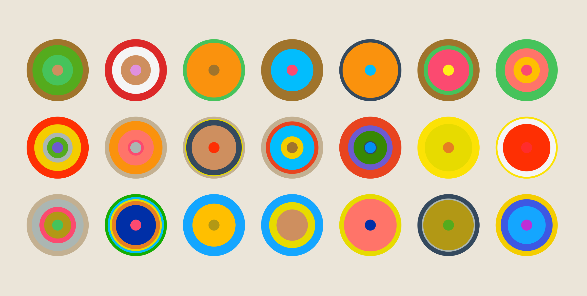
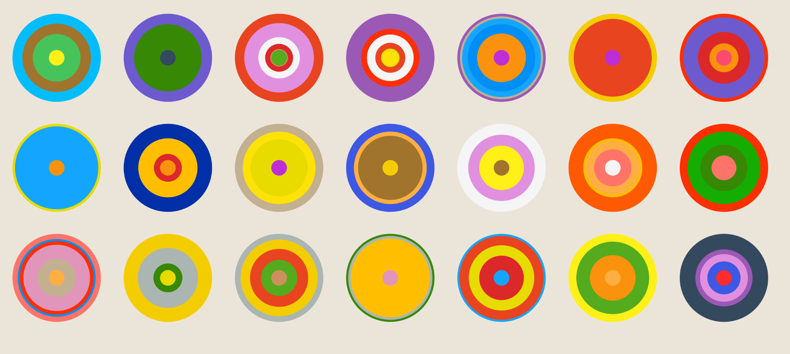

# Quiz8
## Design Research for Major Assignment

### Imaging Technique Inspiration
**Major project** : *Wheels of Fortune by Pacita Abad*

**Inspiration Source**:*Circle Pattern by Lee Doughty*
 Screenshot1:

 Screenshot2:

This sketch features colorful concentric circles that regenerate in response to mouse clicks. The simple interactions trigger rich visual changes. I plan to incorporate this “concentric structure” technique into my final project (Wheels of Fortune), as it aligns with my goal of creating a dynamic, joyful, and culturally expressive visual experience.

### Coding Technique Exploration
**Technique** : *Radial Pattern Generation using Polar Coordinates*

Using polar coordinates and concentric loop logic makes it easier to create radial patterns, as seen in the OpenProcessing example. This technique helps me draw repeated elements around a center point, which is essential for building “wheel-like” motifs. It simplifies complex geometric design into a few nested loops and helps express cultural pattern symmetry digitally.

[Code Link](https://openprocessing.org/sketch/2325929)
