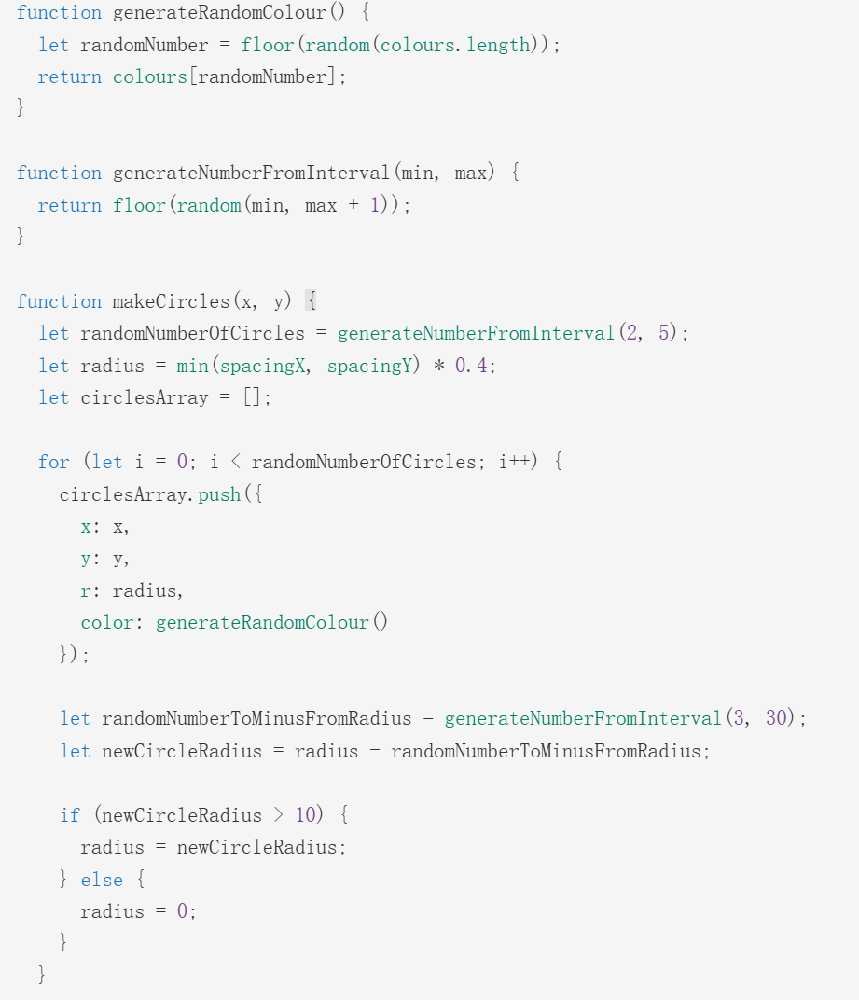

# Quiz8
## Design Research for Major Assignment

### Imaging Technique Inspiration
**Major project** : *Wheels of Fortune by Pacita Abad*

**Inspiration Source**:*Circle Pattern by Lee Doughty*

This sketch features colorful concentric circles that regenerate in response to mouse clicks. The simple interactions trigger rich visual changes. I plan to incorporate this “concentric structure + randomness” technique into my final project (Wheels of Fortune), as it aligns with my goal of creating a dynamic, joyful, and culturally expressive visual experience.

### Coding Technique Exploration
**Technique** : *Randomization for Visual Variation*

In this project, I will use randomness to generate unexpected variations in shape, color, and pattern. Each concentric circle pattern is created with a random number of layers, randomly chosen colors, and variable sizes. Additionally, mouse clicks trigger new randomly generated designs in specific areas.

[Code Link](https://openprocessing.org/sketch/2325929)
